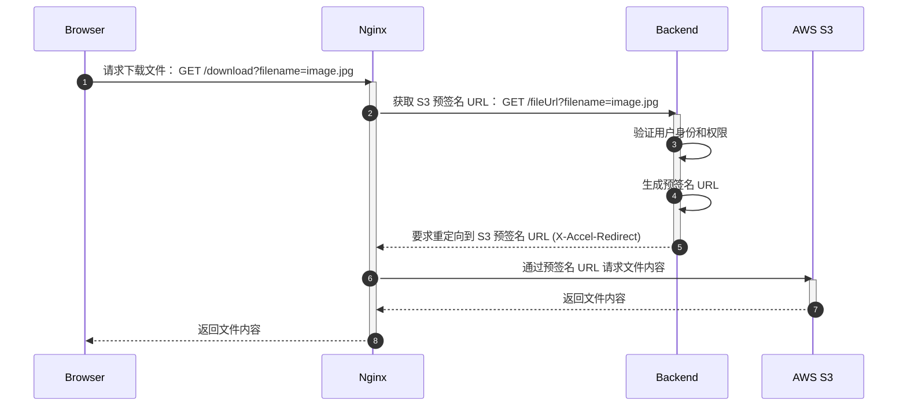

## 具体需求

之前接到一个需求：前端请求下载文件后，先在后端进行权限验证，之后生成 S3 的预签名 URL，再通过 Nginx 进行文件的下载。

流程图：



## 其中主要的步骤

### 1. 前端请求获取文件

前端需要展示或者下载文件时，向 Nginx发送获取文件的请求。

### 2. Nginx 向后端请求 S3 预签名 URL

由于 S3 的 Bucket 是加密的，并且 Nginx 没有权限直接访问 S3，所以要向后端请求预签名 URL 来获得访问权限。

### 3. 后端验证用户身份权限

根据实际业务需求后端可以通过请求内容（session 或 token）来验证用户的权限。

### 4. 生成预签名 URL

后端使用 S3 的访问权限来生成预签名 URL，使得任何拥有 URL 的人都可以访问文件对象。

### 5. 要求 Nginx 重定向到 S3

后端使用 Nginx 的 X-Accel 功能，通过在 Response 的 Header 中设置 `X-Accel-Redirect`，来让 Nginx 自动进行跳转。

```javascript
// 设置返回的 headers
response.headers['X-Accel-Redirect'] = 
    '/s3-redirect/filename/https://example-bucket.s3.amazonaws.com/example-object?key=value&Expires=1672531200&Signature=xxxxxx&x-amz-security-token=xxxxxx&x-amz-algorithm=AWS4-HMAC-SHA256'
```

> 关于 Nginx 的 X-Accel 功能，可以参考 [官方文档](https://www.nginx.com/resources/wiki/start/topics/examples/x-accel/){:target="_blank"} 。
{: .prompt-info }

### 6. Nginx 根据后端返回的头部进行跳转

Nginx 在接收到返回之后，如果 headers 中有设置 `X-Accel-Redirect` 的值，那么会自动跳转到该 location。

配置文件例子如下：

```nginx
server {
    # ...

    # 前端访问 /files?filename=xxx 时，将请求发送给后端
    location /files {
        # 如果使用 k8s 则需要添加本地的 DNS resolver
        resolver kube-dns.kube-system.svc.cluster.local;

        # 跳转到后端地址，默认不会传递参数，所以要手动加上参数
        proxy_pass http://backend.namespace.svc.cluster.local/api/file-download$is_args$args;
    }

    # 在步骤 5 中已经将 `X-Accel-Redirect` 设置为以 `s3-redirect` 开头，因此会匹配下面的 location
    # 并用正则表达式取出文件名和 S3 的URL，其中 $1 为文件名，$2 为跳转地址
    location ~ ^/s3-redirect/(.*?)/(.*) {
        # 只允许内部跳转，前端无法通过输入 URL 直接访问，增强了安全性
        internal;
        # 由于要跳转到 S3 的地址，需要加上外部 DNS，这里用谷歌的 DNS
        resolver 8.8.8.8;

        # 跳转到 S3 并下载文件，同样记得带上参数
        proxy_pass $2$is_args$args;
        
        # 添加头部，若为图片等可以内联展示的文件则直接展示，如果不能（PDF 等文件）则下载文件并保存为指定的文件名
        add_header Content-Disposition 'inline; filename="$1"';
    }

}
```
{: file='nginx.conf' }

上面的例子是真实案例，可以根据实际情况简化一些设置，比如不需要 k8s 的 DNS resolver 设置，以及不需要文件下载的相关设置。

> 关于 Nginx 的 内置变量，可以参考 [官方文档](http://nginx.org/en/docs/http/ngx_http_core_module.html#var_arg_){:target="_blank"} 。
>
> 关于 Nginx 默认不会传递查询参数，可以看[这篇回答](https://stackoverflow.com/a/64413187)。
{: .prompt-info }


## 总结当时踩的几个坑

1. k8s 通过 service 名来访问其他 service 的时候需要加上本地的 DNS resolver
2. proxy_pass 默认不会传递参数，需要用内置变量手动传递
3. Nginx 的路径匹配规则，正则匹配，贪婪和非贪婪
4. internal 关键字
5. 跳转到外部时需要加上外部的 DNS resolver
6. 手动添加 headers 来控制文件的下载

## 参考资料

- [S3 の非公開ファイルを nginx X-Accel-Redirect と Rails の認証セッションを使って限定公開する \| Basicinc Enjoy Hacking!](https://tech.basicinc.jp/articles/189){:target="_blank"}
- [Nginx proxy Amazon S3 resources - Stack Overflow](https://stackoverflow.com/a/44749584){:target="_blank"}
