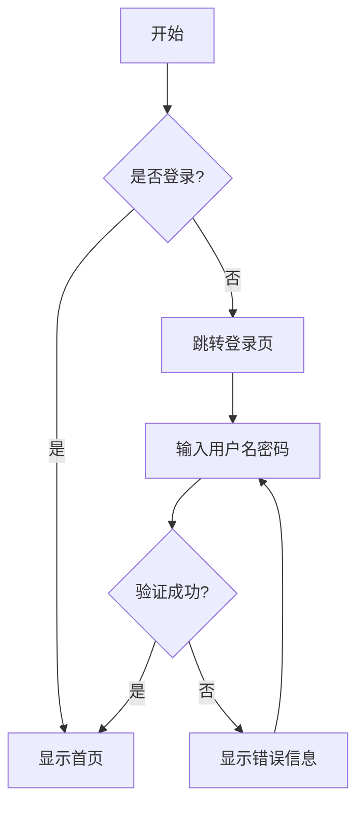

## 为什么程序员需要 Slidev？

作为程序员，你是否遇到过这样的痛点：

- 用传统的 PowerPoint 或 Keynote 制作技术演示，代码格式混乱、语法高亮缺失
- 需要展示代码片段时，只能截图粘贴，既不美观也无法复制
- 想要版本控制演示文稿，但二进制格式无法进行有效的 diff 和 merge
- 团队协作时，不同人使用的软件版本和字体导致排版错乱
- 想要在演示中加入交互元素或动画，但传统工具限制很多

传统的演示工具虽然功能强大，但对程序员来说并不友好。我们更习惯用代码来描述一切，更喜欢用 Markdown 来写文档，更需要将代码优雅地展示给观众。

这时候就轮到我们的主角 [Slidev](https://sli.dev/){:target="_blank"} 登场了。

> Slidev 完美解决了程序员制作技术演示的痛点，让我们可以用最熟悉的方式创建最专业的演示文稿。
{: .prompt-info }

## 什么是 Slidev？

[Slidev](https://sli.dev/){:target="_blank"} 是一个面向开发者的演示文稿制作工具，全名是 "Presentation Slides for Developers"。翻译成人话就是专门为程序员设计的 PPT 制作工具。

### 核心特性

- **基于 Markdown**：使用熟悉的 Markdown 语法编写内容
- **代码友好**：内置语法高亮，支持多种编程语言
- **主题丰富**：提供多种精美主题，也支持自定义
- **交互性强**：支持动画、图表、数学公式等丰富的交互元素
- **现代技术栈**：基于 Vue 3、Vite 和 UnoCSS 构建
- **版本控制**：纯文本格式，完美支持 Git
- **导出灵活**：可导出为 PDF、PPTX、PNG 或静态网站

### 与传统工具的区别

|特性|传统 PPT|Slidev|
|:-|:-|:-|
|编辑方式|图形界面|代码编辑器|
|文件格式|二进制|纯文本 Markdown|
|代码展示|截图/复制粘贴|原生语法高亮|
|版本控制|困难|完美支持|
|主题定制|复杂|CSS/Vue 组件|
|团队协作|容易冲突|Git 协作|
|导出格式|有限|多种格式|

## 快速开始

### 环境要求

在开始之前，确保你的环境满足以下要求：

- Node.js 版本 ≥ 18.0
- 包管理器：npm、yarn 或 pnpm（推荐）

### 安装 Slidev

推荐使用 pnpm 创建新的 Slidev 项目：

```sh
pnpm create slidev
```

也可以使用 npm：

```sh
npm create slidev@latest
```

或者 yarn：

```sh
yarn create slidev
```

### 创建第一个演示文稿

运行创建命令后，会提示你输入项目名称：

```sh
? Project name: my-slidev-presentation
? Package name: my-slidev-presentation
```

创建完成后，进入项目目录：

```sh
cd my-slidev-presentation
```

### 启动开发服务器

```sh
pnpm dev
# 或者
npm run dev
```

默认情况下，开发服务器会在 `http://localhost:3030` 启动。在浏览器中打开这个地址，你就可以看到你的第一个 Slidev 演示文稿了！

> 开发服务器支持热重载，修改 Markdown 文件后会自动刷新浏览器。这种实时预览的体验比传统 PPT 工具要流畅很多。
{: .prompt-tip }

## 核心功能详解

### Markdown 语法基础

Slidev 的核心是 Markdown，但相比普通的 Markdown，它添加了一些演示文稿专用的语法。

#### 幻灯片分隔

使用三个连字符 `---` 来分隔幻灯片：

```markdown
# 第一张幻灯片

这是第一张幻灯片的内容。

---

# 第二张幻灯片

这是第二张幻灯片的内容。
```

#### Front Matter 配置

每张幻灯片都可以通过 Front Matter 进行配置：

```markdown
---
layout: cover
background: https://source.unsplash.com/1920x1080/?nature,water
---

# 欢迎来到我的演示

一个很棒的演示文稿

---
layout: default
---

# 目录

- 第一部分
- 第二部分
- 第三部分
```

### 代码高亮和展示

这是 Slidev 最强大的功能之一。支持几乎所有主流编程语言的语法高亮：

```markdown
​```typescript
interface User {
  id: number
  name: string
  email: string
}

const createUser = (user: User): Promise<User> => {
  return fetch('/api/users', {
    method: 'POST',
    headers: { 'Content-Type': 'application/json' },
    body: JSON.stringify(user)
  }).then(res => res.json())
}
​```
```

#### 代码行高亮

可以高亮特定的代码行：

```markdown
​```typescript {2,5-7}
interface User {
  id: number  // 这行会被高亮
  name: string
  email: string
  created_at: Date  // 这几行
  updated_at: Date  // 也会被
  deleted_at?: Date // 高亮显示
}
​```
```

#### 代码行号

显示代码行号：

```markdown
​```typescript {lines:true}
const fibonacci = (n: number): number => {
  if (n <= 1) return n
  return fibonacci(n - 1) + fibonacci(n - 2)
}
​```
```

### 布局系统

Slidev 提供了丰富的内置布局，适用于不同的演示场景：

#### 基础布局

```markdown
---
layout: default
---

# 默认布局

适用于大部分内容展示

---
layout: center
---

# 居中布局

内容会在页面中央显示

---
layout: cover
---

# 封面布局

适合作为演示的开头或章节分隔
```

#### 双栏布局

```markdown
---
layout: two-cols
---

# 左侧内容

这里是左侧的内容，可以是文字、列表或任何 Markdown 内容。

::right::

# 右侧内容

这里是右侧的内容，通常用于对比或补充说明。
```

#### 图片布局

```markdown
---
layout: image-right
image: https://source.unsplash.com/1920x1080/?coding
---

# 代码之美

左侧是内容，右侧是图片。
适合展示概念和视觉效果的结合。
```

### 主题选择和自定义

#### 使用官方主题

Slidev 提供了多种精美的主题，在项目根目录的 `slides.md` 文件顶部配置：

```markdown
---
theme: seriph
---
```

常用主题推荐：

- `default`: 简洁的默认主题
- `seriph`: 优雅的衬线字体主题
- `apple-basic`: 苹果风格的简洁主题
- `bricks`: 现代化的砖块风格主题
- `carbon`: IBM Carbon 设计风格

#### 安装第三方主题

```sh
pnpm add -D slidev-theme-theme-name
```

然后在配置中使用：

```markdown
---
theme: theme-name
---
```

## 进阶功能

### 动画效果

Slidev 支持丰富的动画效果，让你的演示更生动。

#### 点击动画

使用 `v-click` 指令创建点击显示的动画：

```markdown
- <v-click>第一点</v-click>
- <v-click>第二点</v-click>
- <v-click>第三点</v-click>
```

#### 代码逐行显示

```markdown
​```typescript {1|2-3|4-6|all}
interface APIResponse<T> {
  data: T
  status: number
  message: string
  timestamp: number
  success: boolean
}
​```
```

### 交互组件

#### 计数器组件

```vue
<Counter :count="10" />
```

#### 图表展示

使用 Mermaid 绘制流程图：



#### 数学公式

支持 LaTeX 格式的数学公式：

```markdown
行内公式：$x = \frac{-b \pm \sqrt{b^2 - 4ac}}{2a}$

块级公式：
$$
\begin{aligned}
\nabla \cdot \vec{E} &= \frac{\rho}{\epsilon_0} \\
\nabla \cdot \vec{B} &= 0 \\
\nabla \times \vec{E} &= -\frac{\partial\vec{B}}{\partial t} \\
\nabla \times \vec{B} &= \mu_0\vec{J} + \mu_0\epsilon_0\frac{\partial\vec{E}}{\partial t}
\end{aligned}
$$
```

### 自定义样式

#### 局部样式

在幻灯片中添加样式：

```markdown
---
layout: center
---

# 标题

<style>
h1 {
  background-color: #2B90B6;
  background-image: linear-gradient(45deg, #4EC5D4 10%, #146b8c 20%);
  background-size: 100%;
  -webkit-background-clip: text;
  -moz-background-clip: text;
  -webkit-text-fill-color: transparent;
  -moz-text-fill-color: transparent;
}
</style>
```

#### 全局样式

在项目根目录创建 `style.css` 文件：

```css
.slidev-layout {
  font-family: 'JetBrains Mono', monospace;
}

.code-block {
  border-radius: 8px;
  box-shadow: 0 4px 12px rgba(0, 0, 0, 0.1);
}
```

## 实用工作流程

### 演示文稿制作流程

#### 1. 规划结构

在开始编写之前，先规划好演示的整体结构：

```markdown
---
theme: seriph
background: https://source.unsplash.com/1920x1080/?code
title: 我的技术分享
---

# 目录规划

1. 问题背景
2. 技术选型
3. 实现方案
4. 效果展示
5. 总结与展望
```

#### 2. 内容编写

按照规划逐步编写内容：

```markdown
---
layout: section
---

# 问题背景

---

# 面临的挑战

- **性能问题**：现有方案处理大数据时延迟较高
- **维护成本**：代码复杂度高，难以维护
- **扩展性差**：难以适应业务快速变化

<v-click>

## 为什么需要重构？

</v-click>
```

#### 3. 视觉优化

添加图片、图表和动画：

```markdown
---
layout: image-right
image: /images/architecture-diagram.png
---

# 新的架构设计

- 微服务架构
- 事件驱动
- 容器化部署

<v-click>

性能提升 **300%**！

</v-click>
```

### 导出和分享

#### 导出 PDF

```sh
pnpm run export
```

这会在 `dist` 目录生成 PDF 文件。

#### 导出为静态网站

```sh
pnpm run build
```

生成的静态文件可以部署到任何静态托管服务。

#### 自定义导出选项

在 `package.json` 中添加导出脚本：

```json
{
  "scripts": {
    "export:pdf": "slidev export --format pdf",
    "export:png": "slidev export --format png",
    "export:pptx": "slidev export --format pptx",
    "build:gh-pages": "slidev build --base /my-presentation/"
  }
}
```

### 版本控制集成

由于 Slidev 使用纯文本格式，可以完美地与 Git 集成：

```sh
# 创建新分支进行演示修改
git checkout -b update-presentation

# 提交更改
git add slides.md
git commit -m "feat: add new section about performance optimization"

# 合并到主分支
git checkout main
git merge update-presentation
```

### 团队协作最佳实践

#### 1. 目录结构组织

```
my-presentation/
├── slides.md              # 主演示文件
├── pages/                 # 分页内容
│   ├── 01-introduction.md
│   ├── 02-background.md
│   └── 03-solution.md
├── components/            # 自定义组件
├── public/               # 静态资源
│   └── images/
├── styles/               # 样式文件
└── package.json
```

#### 2. 分工协作

```markdown
---
# slides.md - 主文件，由项目负责人维护
src: ./pages/01-introduction.md
---

---
# 各部分由不同成员负责
src: ./pages/02-background.md
---

---
src: ./pages/03-solution.md
---
```

## 最佳实践

### 内容组织建议

#### 1. 一屏一概念

每张幻灯片只讲一个核心概念，避免信息过载：

```markdown
---
layout: center
---

# 单一职责原则

一个类应该只有一个引起它变化的原因

---
layout: default
---

# 举个例子

​```typescript
// ❌ 违反单一职责原则
class User {
  save() { /* 保存到数据库 */ }
  sendEmail() { /* 发送邮件 */ }
  generateReport() { /* 生成报表 */ }
}
​```

<v-click>

​```typescript
// ✅ 遵循单一职责原则
class User {
  constructor(public data: UserData) {}
}

class UserRepository {
  save(user: User) { /* 保存到数据库 */ }
}

class EmailService {
  sendEmail(user: User) { /* 发送邮件 */ }
}
​```

</v-click>
```

#### 2. 逐步展示复杂概念

使用动画逐步展示复杂的概念：

```markdown
---
layout: default
---

# React 组件生命周期

<v-clicks>

1. **挂载阶段 (Mounting)**
   - constructor()
   - componentDidMount()

2. **更新阶段 (Updating)**
   - componentDidUpdate()
   - getSnapshotBeforeUpdate()

3. **卸载阶段 (Unmounting)**
   - componentWillUnmount()

</v-clicks>
```

### 视觉设计原则

#### 1. 保持一致的样式

定义统一的代码块样式：

```markdown
<style>
.code-container {
  background: #1e1e1e;
  border-radius: 8px;
  padding: 20px;
  margin: 20px 0;
}

.highlight {
  background: #ffd700;
  padding: 2px 4px;
  border-radius: 4px;
}
</style>
```

#### 2. 合理使用颜色

使用颜色来区分不同类型的信息：

```markdown
- <span style="color: #4CAF50">✅ 推荐做法</span>
- <span style="color: #FF5722">❌ 不推荐做法</span>
- <span style="color: #2196F3">💡 提示信息</span>
```

### 性能优化技巧

#### 1. 图片优化

```markdown
---
layout: image-right
image: /images/optimized-chart.webp
---

# 性能监控图表

使用 WebP 格式可以减少 25% 的文件大小
```

#### 2. 懒加载重内容

对于包含大量图片或复杂组件的幻灯片，使用懒加载：

```vue
<template>
  <div v-if="$slidev.nav.clicks > 0">
    <HeavyComponent />
  </div>
</template>
```

### 演示技巧

#### 1. 使用快捷键

在演示过程中掌握这些快捷键：

|快捷键|功能|
|:-|:-|
|<kbd>Space</kbd> / <kbd>→</kbd>|下一步|
|<kbd>←</kbd>|上一步|
|<kbd>f</kbd>|全屏模式|
|<kbd>o</kbd>|幻灯片概览|
|<kbd>d</kbd>|深色模式切换|
|<kbd>g</kbd>|跳转到指定页面|

#### 2. 演讲者备注

添加只有演讲者能看到的备注：

```markdown
---
layout: center
---

# 重要概念

这是一个重要的概念

<!--
这里是演讲者备注，观众看不到。
提醒：记得举例说明这个概念的实际应用。
-->
```

#### 3. 录制和分享

Slidev 支持录制功能：

```sh
pnpm run export --with-clicks --format pdf
```

## 常见问题

### 安装问题

**Q: Node.js 版本过低怎么办？**

A: Slidev 需要 Node.js 18+。推荐使用 [nvm](https://github.com/nvm-sh/nvm){:target="_blank"} 管理 Node.js 版本：

```sh
# 安装最新的 LTS 版本
nvm install --lts
nvm use --lts
```

**Q: pnpm 命令不存在？**

A: 安装 pnpm：

```sh
npm install -g pnpm
```

### 使用技巧

**Q: 如何在代码中显示文件路径？**

A: 使用文件名标注：

```markdown
​```typescript:components/UserCard.vue
<template>
  <div class="user-card">
    {{ user.name }}
  </div>
</template>
​```
```

**Q: 如何添加背景音乐？**

A: 在幻灯片中嵌入音频：

```markdown
---
layout: cover
---

# 欢迎

<audio controls autoplay loop>
  <source src="/audio/background.mp3" type="audio/mpeg">
</audio>
```

**Q: 如何制作代码对比？**

A: 使用双栏布局：

```markdown
---
layout: two-cols
---

# 重构前

​```javascript
function getUserInfo(id) {
  var user = getUser(id)
  var profile = getProfile(id)
  var settings = getSettings(id)
  return {
    user: user,
    profile: profile,
    settings: settings
  }
}
​```

::right::

# 重构后

​```javascript
const getUserInfo = async (id) => {
  const [user, profile, settings] = await Promise.all([
    getUser(id),
    getProfile(id),
    getSettings(id)
  ])
  
  return { user, profile, settings }
}
​```
```

### 故障排除

**Q: 开发服务器启动失败？**

A: 检查端口是否被占用：

```sh
# 使用不同端口启动
pnpm dev --port 3031
```

**Q: 导出 PDF 时样式错误？**

A: 确保安装了必要的依赖：

```sh
pnpm add -D playwright-chromium
```

**Q: 主题不生效？**

A: 检查主题是否正确安装：

```sh
pnpm add -D slidev-theme-seriph
```

然后在 `slides.md` 中配置：

```markdown
---
theme: seriph
---
```

> 如果遇到其他问题，可以查看 [Slidev 官方文档](https://sli.dev/guide/faq.html){:target="_blank"} 或者在 [GitHub Issues](https://github.com/slidevjs/slidev/issues){:target="_blank"} 中搜索解决方案。
{: .prompt-info }

## 总结

Slidev 作为一个专为开发者设计的演示工具，完美解决了程序员在制作技术演示时遇到的各种痛点。它将我们熟悉的 Markdown 语法与现代前端技术相结合，让我们可以用代码的方式来创建演示文稿。

### 核心优势回顾

- **开发者友好**：Markdown + 代码编辑器的组合
- **功能强大**：丰富的布局、主题和交互功能
- **版本控制**：完美支持 Git，便于团队协作
- **现代化**：基于最新的前端技术栈
- **灵活导出**：支持多种格式的导出和分享

### 适用场景

- **技术分享**：内部技术分享、开源项目介绍
- **会议演讲**：技术会议、行业峰会演讲
- **教学培训**：编程课程、技术培训
- **产品展示**：向技术团队展示产品特性
- **文档演示**：将技术文档转化为可视化演示

### 下一步建议

1. **动手实践**：创建你的第一个 Slidev 演示文稿
2. **探索主题**：尝试不同的主题找到最适合的风格
3. **学习进阶功能**：掌握动画、交互组件等高级特性
4. **建立模板**：为团队创建统一的演示模板
5. **分享经验**：与同事分享 Slidev 的使用心得

记住，好的演示不仅仅是工具的使用，更重要的是内容的组织和表达。Slidev 给了我们强大的工具，如何用好它来创造价值才是关键。

开始你的 Slidev 之旅吧，让技术演示变得更加专业和高效！> <

## 参考资源

- [Slidev 官方网站](https://sli.dev/){:target="_blank"}
- [Slidev GitHub 仓库](https://github.com/slidevjs/slidev){:target="_blank"}
- [Slidev 官方文档](https://sli.dev/guide/){:target="_blank"}
- [主题和插件市场](https://sli.dev/themes/gallery.html){:target="_blank"}
- [Slidev Discord 社区](https://discord.gg/eW46SnbzZw){:target="_blank"}
- [Vue.js 官方文档](https://vuejs.org/){:target="_blank"}
- [Markdown 语法指南](https://www.markdownguide.org/){:target="_blank"}