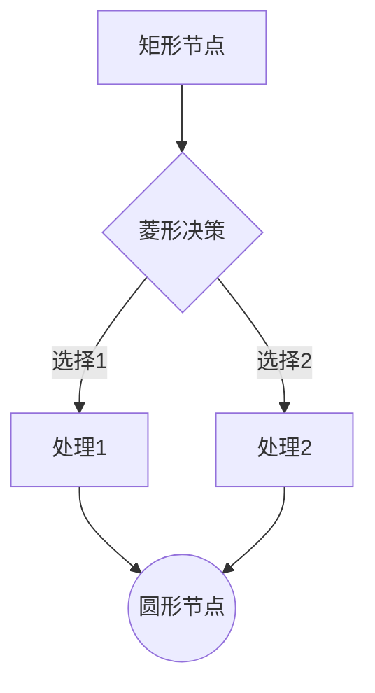
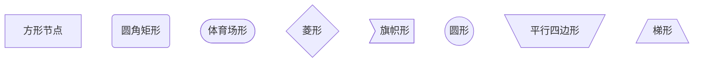
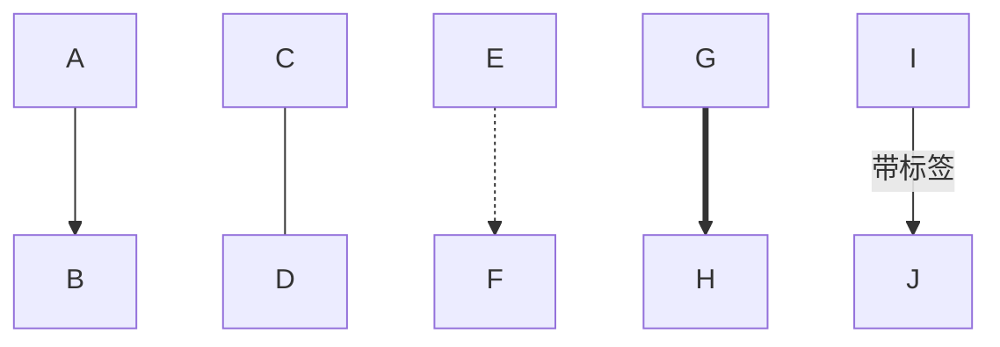
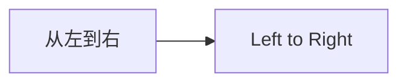
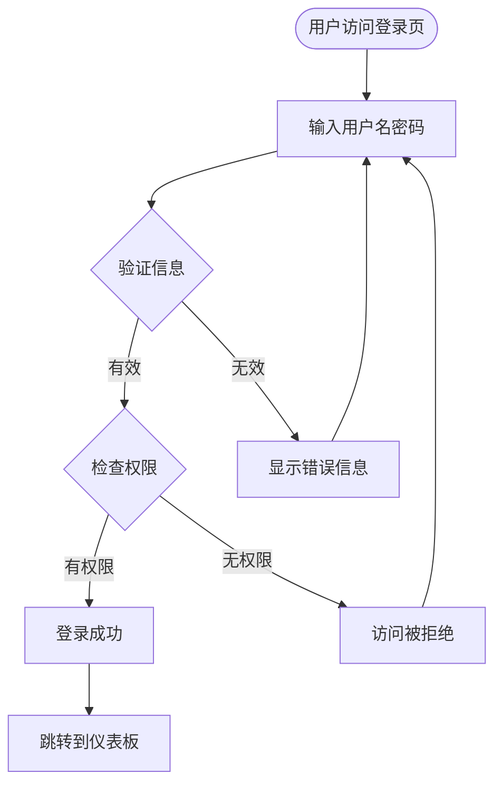
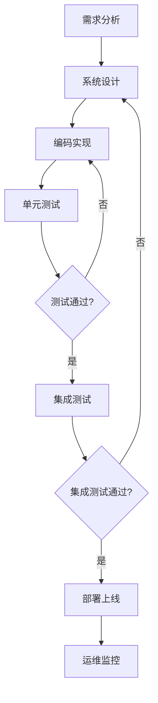
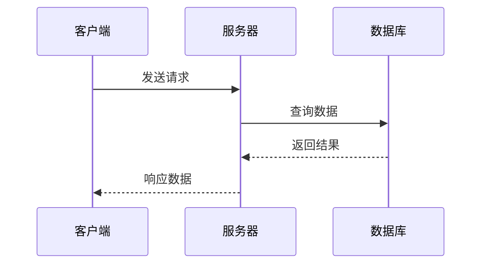
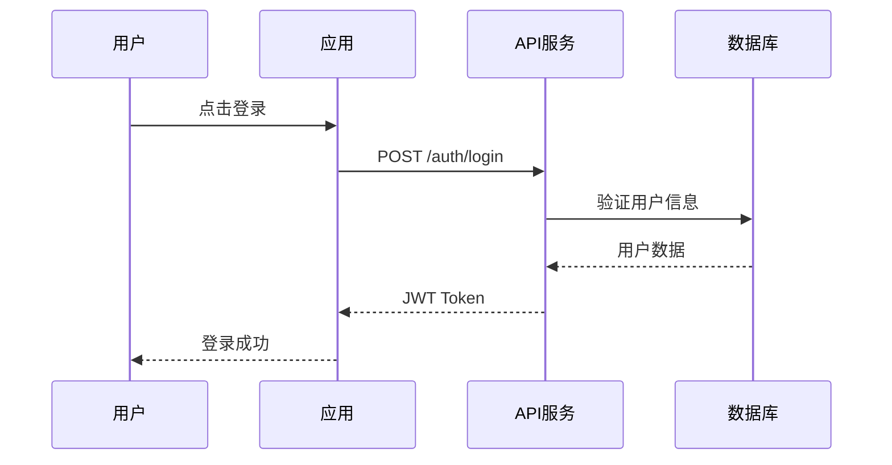
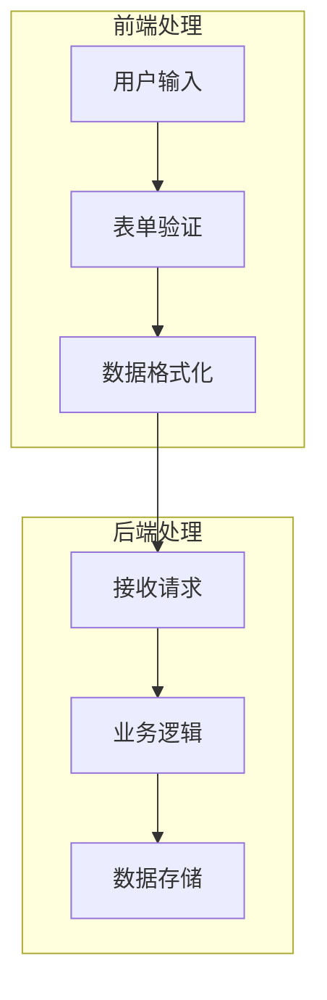
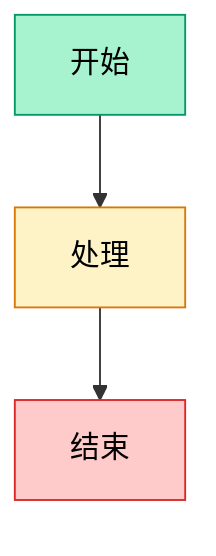

## Mermaid 简介

[Mermaid](https://mermaid.js.org/){:target="_blank"} 是一个基于 JavaScript 的图表和图形绘制工具，它允许你使用文本和代码来创建各种类型的图表。与传统的图形绘制工具不同，Mermaid 使用类似 Markdown 的语法，让创建和维护图表变得简单高效。

> 本文中的所有 Mermaid 图表都会在网页中实际渲染，你可以直接看到代码和最终效果的对比！
{: .prompt-tip }

> Mermaid 在 2019 年获得了 JS Open Source Awards 的"最激动人心的技术使用"奖项
{: .prompt-info }

## 选择 Mermaid 的理由

### 解决文档同步问题
传统的图表工具往往会导致"文档腐烂"（Doc-Rot）问题：
- 图表与代码不同步
- 更新图表需要专门的软件
- 版本控制困难
- 团队协作不便

Mermaid 通过代码化的方式完美解决了这些问题。

### 主要优势
- **简单易学**：语法类似 Markdown，学习成本低
- **版本控制友好**：纯文本格式，易于追踪变更
- **动态渲染**：实时更新，支持多种输出格式
- **广泛支持**：GitHub、GitLab、Notion 等平台原生支持

## Mermaid 支持的图表类型

Mermaid 支持多种常用的图表类型：

1. **流程图（Flowchart）** - 展示工作流程和决策路径
2. **序列图（Sequence Diagram）** - 描述对象间的交互过程
3. **类图（Class Diagram）** - 展示类之间的关系
4. **状态图（State Diagram）** - 描述系统状态转换
5. **实体关系图（ER Diagram）** - 数据库设计图
6. **甘特图（Gantt Chart）** - 项目进度管理
7. **饼图（Pie Chart）** - 数据占比展示
8. **用户旅程图（User Journey）** - 用户体验流程

## 快速开始

### 安装方式

你可以通过多种方式使用 Mermaid：

**CDN 引入**
```html
<script src="https://cdn.jsdelivr.net/npm/mermaid@10/dist/mermaid.min.js"></script>
```

**NPM 安装**
```bash
npm install mermaid
```

**Yarn 安装**
```bash
yarn add mermaid
```

### 基础用法

在 HTML 中使用 Mermaid：

```html
<!DOCTYPE html>
<html>
<head>
    <script src="https://cdn.jsdelivr.net/npm/mermaid@10/dist/mermaid.min.js"></script>
</head>
<body>
    <div class="mermaid">
        flowchart TD
            A[开始] --> B{判断条件}
            B -->|是| C[执行操作]
            B -->|否| D[结束]
            C --> D
    </div>

    <script>
        mermaid.initialize({startOnLoad: true});
    </script>
</body>
</html>
```

## 流程图入门

流程图是最常用的图表类型，让我们从基础语法开始学习。

### 基本语法结构

让我们看一个简单的流程图示例，你可以直接对比代码和渲染效果：

**Mermaid 代码：**
````

````

**渲染效果：**


### 节点形状

Mermaid 支持多种节点形状，以下是常用的形状对比：

**代码示例：**
````

````

**实际效果：**


### 连接线类型



连接线说明：
- `-->` 实线箭头
- `---` 实线无箭头
- `-.->` 虚线箭头
- `==>` 粗实线箭头
- `--> |标签|` 带标签的连接线

### 方向控制



支持的方向：
- `TD` 或 `TB`：从上到下
- `BT`：从下到上
- `LR`：从左到右
- `RL`：从右到左

## 实际应用示例

### 示例 1：用户登录流程

这是一个完整的用户登录流程图，展示了从用户访问到最终跳转的完整过程：

**完整代码：**
````

````

**渲染结果：**


### 示例 2：软件开发流程



## 序列图入门

序列图用于展示不同对象或参与者之间的交互过程。

### 基本语法

序列图展示了不同参与者之间的时间顺序交互，让我们看一个简单的客户端-服务器交互：

**序列图代码：**
````

````

**实际效果：**


### API 调用示例



## 高级技巧

### 1. 子图（Subgraphs）

子图功能可以将相关的节点组织在一起，让复杂流程更清晰：

**子图代码：**
````

````

**渲染效果：**


### 2. 样式自定义

通过 `classDef` 可以为节点定义自定义样式，让图表更加美观：

**样式定义代码：**
````

````

**样式效果：**


## 最佳实践

### 1. 保持简洁
- 避免过于复杂的图表
- 使用有意义的节点标签
- 合理使用颜色和样式

### 2. 版本控制
- 将 Mermaid 代码与项目代码一起管理
- 使用注释说明图表用途
- 定期更新图表以反映最新状态

### 3. 团队协作
- 建立统一的图表规范
- 使用描述性的文件名
- 在文档中嵌入相关图表

## 平台支持

Mermaid 得到了广泛的平台支持：

- **GitHub**：Markdown 文件中原生支持
- **GitLab**：内置 Mermaid 渲染
- **Notion**：支持 Mermaid 代码块
- **VS Code**：通过插件支持预览
- **Obsidian**：原生支持 Mermaid 图表

## 工具推荐

### 在线编辑器
- [Mermaid Live Editor](https://mermaid.live/){:target="_blank"} - 官方在线编辑器
- [Draw.io](https://app.diagrams.net/){:target="_blank"} - 支持 Mermaid 导入

### 编辑器插件
- **VS Code**: Mermaid Preview
- **IntelliJ IDEA**: Mermaid Plugin
- **Vim**: vim-mermaid

## 总结

Mermaid 是一个强大而易用的图表工具，特别适合：

- 📝 技术文档编写
- 🔄 流程梳理和设计
- 👥 团队沟通协作
- 📊 数据可视化展示

通过学习 Mermaid，你可以轻松创建专业的图表，提升文档质量，改善团队协作效率。从简单的流程图开始，逐步探索更多图表类型，你会发现 Mermaid 在日常工作中的巨大价值。

> 开始你的第一个 Mermaid 图表吧！在 [Mermaid Live Editor](https://mermaid.live/){:target="_blank"} 中尝试本文的示例代码。
{: .prompt-tip }